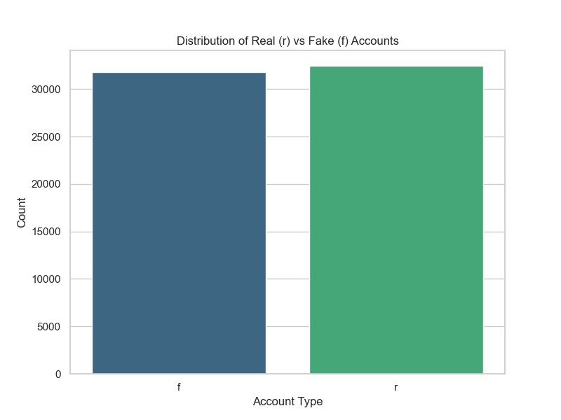
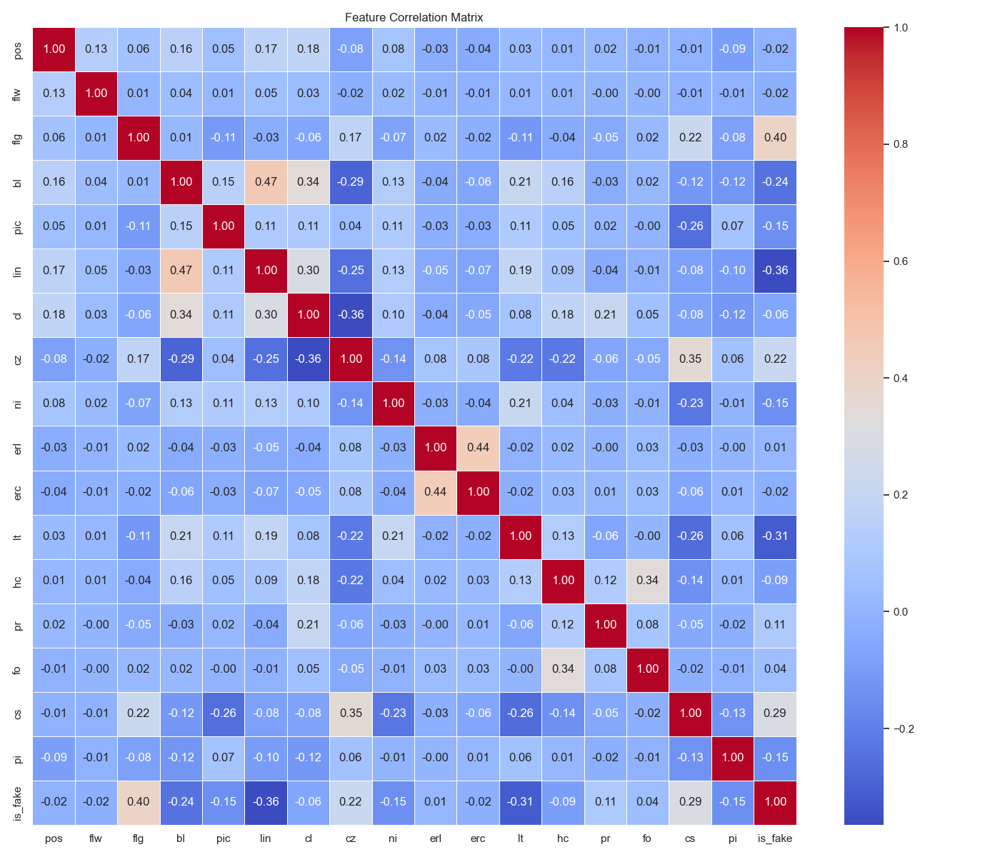
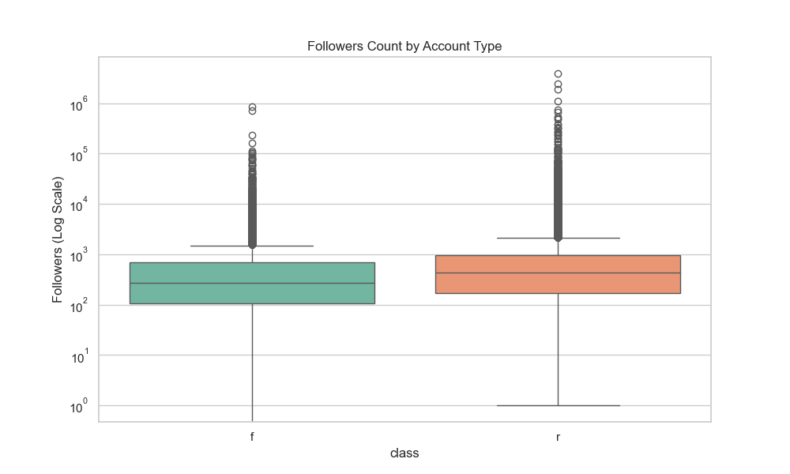
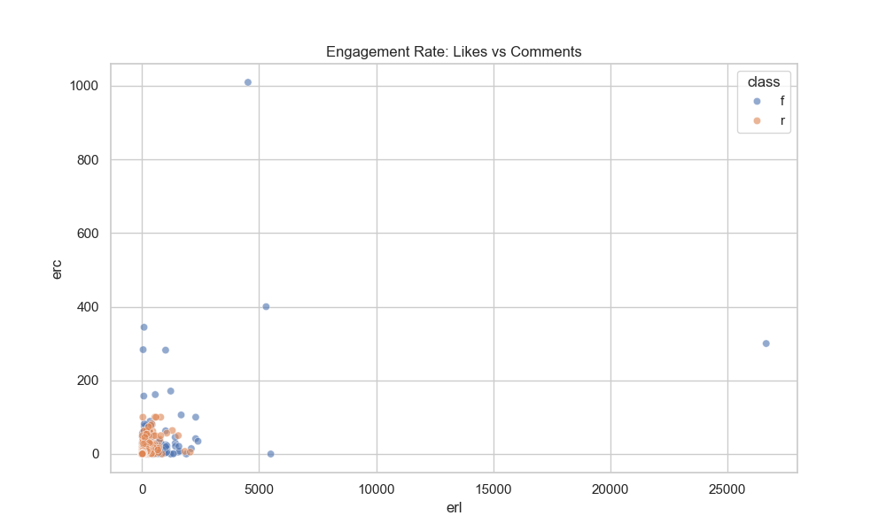
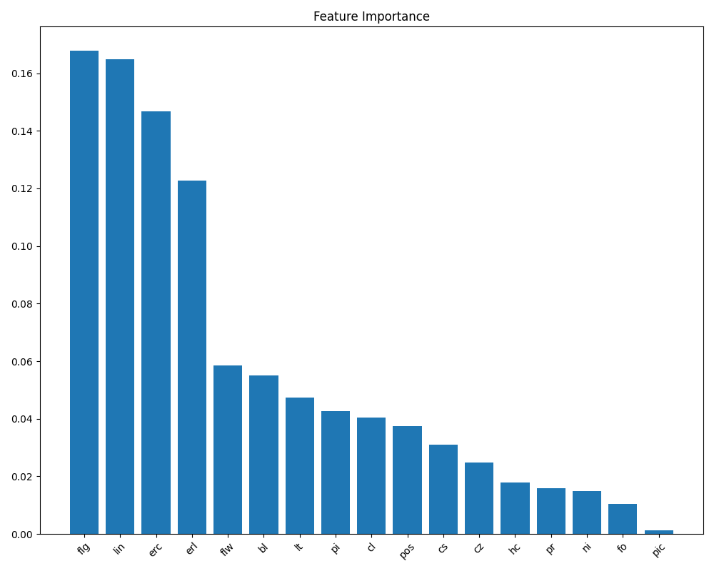
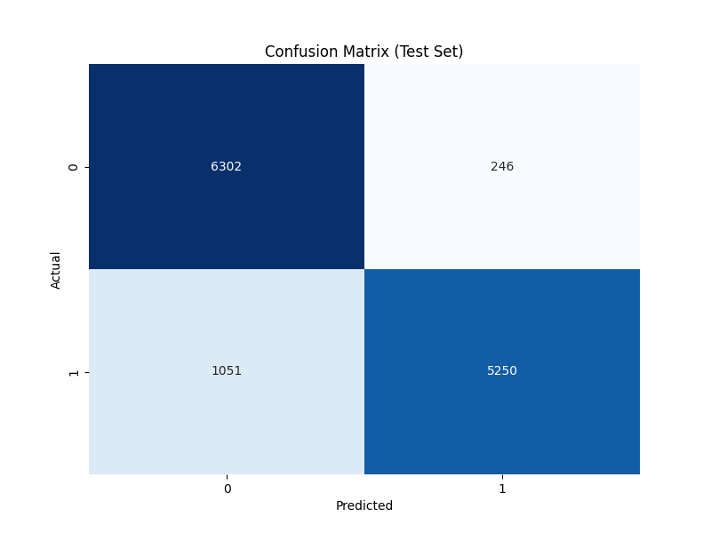
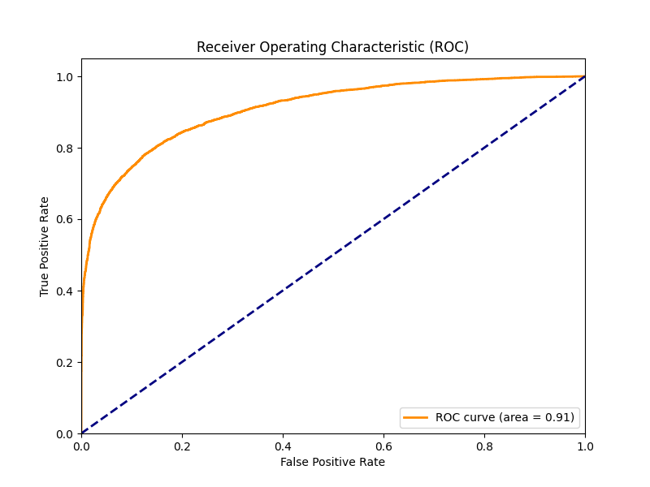

# 🕵️‍♂️ Sosyal Medya Anomali Tespiti: Teknik Derinlik Raporu

**Tarih:** 13 Ocak 2026  
**Hazırlayan:** Serdar Dedebaş  

---

## 1. Giriş: Dijital Maskelerin Ardındaki İstatistik

Sosyal medya platformları, milyarlarca kullanıcının etkileşime girdiği devasa veri okyanuslarıdır. Ancak bu okyanusta, organik kullanıcıların yanı sıra, manipülasyon amacıyla üretilmiş sentetik kimlikler (fake/bot hesaplar) de yüzmektedir. Bu projenin temel amacı, bir sosyal medya hesabının "insani" mi yoksa "yazılımsal" mı olduğunu istatistiksel izler üzerinden tespit etmektir.

Bu rapor, geliştirilen yapay zeka modelinin teknik mimarisini, veri üzerindeki keşiflerimizi, özellik mühendisliği kararlarımızı ve modelin karar mekanizmasını detaylı bir şekilde belgelemektedir. Amacımız sadece "bu hesap sahte" demek değil, **"neden sahte olduğunu"** matematiksel kanıtlarla sunmaktır.

---

## 2. Veri Keşfi ve Analizi (Exploratory Data Analysis)

Her başarılı makine öğrenmesi projesi, veriyi anlamakla başlar.

### 2.1. Veri Kaynağı ve Özellik Havuzu 🗂️
Projede kullanılan veri seti, gerçek dünya senaryolarını yansıtmak amacıyla **[Kaggle: Fake/Authentic User Instagram](https://www.kaggle.com/datasets/krpurba/fakeauthentic-user-instagram)** kaynağından temin edilmiştir. Veri seti, kullanıcıların profil bilgilerinden içerik paylaşım alışkanlıklarına kadar geniş bir yelpazede 18 farklı özellik içermektedir.

Bu özellikler, bir hesabın karakteristiğini ortaya koyan dijital parmak izleri gibidir:

**A. Hesap Profili Özellikleri**
*   **`pos` (Post Sayısı):** Kullanıcının toplam paylaştığı gönderi sayısı. Botlar genelde ya çok az (yeni açılmış) ya da çok fazla (spam) gönderiye sahiptir.
*   **`flg` (Takip Edilen):** Takip ettiği kişi sayısı. Botlar genelde takipçi kazanmak için "Takibe Takip" (f4f) stratejisi izler.
*   **`flr` (Takipçi):** Hesabı takip eden kişi sayısı.
*   **`bl` (Biyografi Uzunluğu):** Profil açıklamasındaki karakter sayısı.
*   **`pic` (Profil Resmi):** Profil resmi var mı (1) yok mu (0). Gerçek kullanıcıların çoğunda resim olurken, botlar bazen varsayılan avatarda kalır.
*   **`lin` (Dış Bağlantı):** Biyografide link olup olmaması. Spam hesaplar genelde reklam veya zararlı linkler barındırır.

**B. İçerik ve Paylaşım Özellikleri**
*   **`cl` (Açıklama Uzunluğu):** Gönderi altındaki metinlerin ortalama karakter uzunluğu.
*   **`cz` (Boş Açıklama Oranı):** Çok kısa (3 karakterden az) açıklamalı gönderilerin oranı. Botlar genelde açıklama yazmaz.
*   **`ni` (Resim Dışı Medya):** Video veya kaydırmalı (carousel) postların oranı. Botlar genelde basit resimler yükler.
*   **`lt` (Konum Etiketi):** Gönderilerde konum (lokasyon) kullanma oranı.
*   **`hc` (Hashtag Sayısı):** Gönderi başına ortalama etiket sayısı.
*   **`cs` (Kosinüs Benzerliği):** Gönderilerin birbirine ne kadar benzediği. Botlar genelde aynı açıklamayı veya resmi tekrar tekrar paylaşır (Yüksek skor = Şüpheli).
*   **`pi` (Paylaşım Aralığı):** İki post arasındaki ortalama süre (saat). İmkansız sıkılıkta ve düzenlilikte paylaşımlar bot belirtisidir.

**C. Etkileşim ve Anahtar Kelime Özellikleri**
*   **`erl` / `erc` (Etkileşim Oranları):** Beğeni ve yorum sayısının takipçi sayısına oranı. Botların takipçisi çok ama etkileşimi (like/yorum) genelde çok düşüktür.
*   **`pr` (Promosyon Kelimeleri):** "Çekiliş", "repost", "yarışma" gibi reklam içerikli kelimelerin kullanım sıklığı.
*   **`fo` (Takipçi Avcı Kelimeleri):** "Takip et", "f4f", "beğen" gibi takipçi kasmaya yönelik etiketlerin kullanım sıklığı.
*   **`class` (Sınıf):** Hedef değişkenimiz. `f` (fake/sahte) veya `r` (real/gerçek).

### 2.2. Sınıf Dağılımı ve Denge
Modelin önyargılı olmaması için veri setinin dengeli olması kritiktir. Yaptığımız analizde, "Gerçek" (Real) ve "Sahte" (Fake) hesapların birbirine yakın oranlarda dağıldığını gördük. Bu, `Accuracy` (Doğruluk) metriğinin güvenilir bir performans göstergesi olabileceğini işaret eder.

*(Grafik 1: Veri setindeki Gerçek ve Sahte hesapların sayısal dağılımı. Dengeli bir yapı, modelin her iki sınıfı da eşit ağırlıkta öğrenmesini sağlar.)*

### 2.3. Özelliklerin Korelasyon Matrisi
Hangi özelliklerin birbiriyle ilişkili olduğunu (Multicollinearity) ve hangilerinin hedef değişkenle (`class`) güçlü bağ kurduğunu anlamak için korelasyon matrisini inceledik.

*   **Gözlem:** Bazı özellikler (örneğin takipçi sayısı ve beğeni ortalaması) arasında beklenen pozitif korelasyonlar vardır. Ancak bizim için asıl önemli olan, `class` (hedef) değişkeni ile olan ilişkilerdir.
*   **Yorum:** Koyu renkli alanlar, güçlü ilişkileri temsil eder. Özellikle türetilmiş oranların (örneğin takipçi/takip oranı) hedef değişkenle ilişkisi dikkat çekicidir.

*(Grafik 2: Özellikler arası korelasyon haritası. Renkler ilişkinin yönünü ve şiddetini gösterir.)*

### 2.4. Derinlemesine Bakış: "Takipçi" ve "Etkileşim"
Sahte hesapları ele veren en büyük açık, davranışsal tutarsızlıklardır.

*   **Takipçi (Followers):** Gerçek hesaplarda takipçi sayısı genellikle logaritmik bir dağılım izler (az sayıda kişi çok takipçiye sahiptir). Sahte hesaplarda ise bu dağılım daha sentetiktir.
    
    *(Grafik 3: Takipçi sayılarının sınıf bazında dağılımı (Boxplot). Aykırı değerlerin ve medyan farklarının sınıfları nasıl ayırdığına dikkat edin.)*

*   **Etkileşim (Engagement):** Bir bot hesabı binlerce kişiyi takip edebilir ama "gerçek" bir etkileşim (yorum/beğeni oranı) yaratmak zordur. Aşağıdaki grafik, Beğeni Oranı (`erl`) ve Yorum Oranı (`erc`) arasındaki ilişkiyi gösterir. Sahte hesaplar genellikle düşük etkileşim kümelerinde toplanırken, gerçek hesaplar daha geniş bir alana yayılır.
    
    *(Grafik 4: Beğeni ve Yorum oranlarının saçılım grafiği. Kümeler arası ayrışma, modelin bu iki özelliği kullanarak karar verebileceğini kanıtlar.)*

---

## 3. Özellik Mühendisliği (Feature Engineering)

Ham veri, bir model için her zaman yeterli değildir. Veriyi modelin "anlayabileceği" bir dile çevirmek gerekir.

### 3.1. Türetilen ve Seçilen Özellikler
Modelin başarısının %80'i doğru özelliklerin seçimine bağlıdır.
*   **`ratio` (Takipçi / Takip Oranı):** Bu, projenin "Yıldız Özelliği"dir.
    *   *Mantık:* Bir bot genellikle takipçi kazanmak için "Takibe Takip" yapar. Bu da oranını 1.0'e çeker. Gerçek bir fenomende ise bu oran 1000'lere çıkabilir.
*   **`ni` (Non-Image Ratio):** Videolu veya resimsiz içerik oranı. Bot yazılımları metin tabanlı etkileşimi sever, görsel işleme maliyetlidir.

### 3.2. Dışarıda Bırakılanlar (Dropped Features) 🗑️
Modeli laboratuvar ortamından çıkarıp gerçek dünyaya uyarlarken, "Teorik Maksimum Doğruluk" ile "Pratik Kullanılabilirlik" arasında bir takas (trade-off) yapmak zorunda kaldık. Aşağıdaki özellikler, modelin eğitiminde etkili olsalar da, son kullanıcının manuel olarak hesaplamasının imkansız veya çok zor olması nedeniyle sistemden çıkarılmıştır:

*   **`pi` (Posting Interval - Paylaşım Sıklığı):** "Son 30 gönderinin atılma saatleri arasındaki standart sapma" gibi karmaşık bir metrik. Bunu bir insanın hesaplaması dakikalar sürer.
*   **`erl` & `erc` (Engagement Rate Likes/Comments):** Beğeni ve Yorum oranları. Bunlar dinamiktir ve anlık olarak değişir. Kullanıcıdan "Toplam Beğeni / Toplam Post / Takipçi Sayısı" formülünü hesaplamasını istemek UX (Kullanıcı Deneyimi) katilidir.
*   **`pr` (Promotional Keywords):** İçerikte ne kadar "#giveaway", "#repost" gibi promosyon kelimesi geçtiği. Bunu tespit etmek için kullanıcının NLP (Doğal Dil İşleme) yapması gerekir.
*   **`fo` (Follower Hunter Keywords):** "#follow4follow", "#like4like" gibi etiketlerin kullanım sıklığı. Yine manuel tespiti çok zordur.

**Karar:** Bu özellikleri çıkarmak modelin doğruluğundan önemsiz bir miktar (binde 2-3 civarı) götürse de, sistemin herkes tarafından 10 saniye içinde kullanılabilir olmasını sağlamıştır. "Hızlı ve İyi" bir model, "Mükemmel ama Kullanılamaz" bir modelden üstündür.

*(Grafik 5: Modelin karar verirken en çok hangi özelliğe güvendiğini gösteren önem sıralaması. Listenin başındaki özellikler, sahte hesap avcılarıdır.)*

---

## 4. Model Seçimi ve Performans Karşılaştırması 🌲 vs 🚀

Proje kapsamında dört farklı güçlü algoritma "Arena"ya çıkarılmış ve kıyasıya yarıştırılmıştır. İşte modellerin test seti üzerindeki performans karnesi:

| Model | Accuracy (Doğruluk) | F1-Score | ROC-AUC | Durum |
| :--- | :--- | :--- | :--- | :--- |
| **XGBoost** | **0.8249** | **0.8177** | **0.9087** | 🥇 (Skor Lideri) |
| **Random Forest** | 0.8222 | 0.8133 | 0.9038 | 🌲 **(Seçilen Model)** |
| **Neural Network (MLP)** | 0.8203 | 0.8093 | 0.9011 | Yarışmacı |
| **Logistic Regression** | 0.7830 | 0.7752 | 0.8600 | Baseline (Taban) |

### Neden XGBoost Değil de Random Forest? 🤔
Tabloya bakıldığında XGBoost'un matematiksel olarak (binde 2.7 farkla) daha üstün olduğu görülmektedir. Ancak mühendislik kararları sadece ham puana göre verilmez. Projemizde **Random Forest**'ın ana model olarak seçilmesinin kritik sebepleri şunlardır:

1.  **Gürültüye Direnç (Robustness):** XGBoost, hataları minimize etmek için agresif (boosting) bir yöntem izler. Sosyal medya verilerinde etiketlerin (gerçek/sahte) hatalı olma ihtimali yüksektir. XGBoost bu hatalı verileri "ezberleyip" (overfit) skoru yapay olarak şişirebilir. Random Forest ise "Bagging" yöntemiyle çoğunluğun oyuna baktığı için bu tip gürültülere karşı daha dirençli ve güvenilirdir.
2.  **Genellenebilirlik:** Binde 2'lik (%0.2) bir fark, gerçek hayatta ihmal edilebilir bir kazançtır. Buna karşılık Random Forest'ın yeni ve görülmemiş veri tiplerinde daha stabil çalışma eğilimi vardır.
3.  **Açıklanabilirlik:** Projemizin amacı "neden sahte?" sorusuna cevap vermektedir. Random Forest'ın karar mekanizması, ağaç yapısı sayesinde daha şeffaf ve izlenebilirdir.

**Optimizasyon Süreci (GridSearchCV):**
Seçilen Random Forest modeli ham haliyle bırakılmamış, 72 farklı parametre kombinasyonu test edilerek evrimleştirilmiştir.
*   **`n_estimators`: 200** (Daha stabil karar için ağaç sayısı iki katına çıkarıldı)
*   **`min_samples_split`: 5** (Aşırı öğrenmeyi engellemek için filtre)
Modeli varsayılan ayarlarla bırakmadık. `GridSearchCV` tekniği ile 72 farklı kombinasyonu test ederek en iyi sonucu veren "Genetik Kodları" bulduk. İşte şampiyon modelin parametreleri:

*   **`n_estimators` (Ağaç Sayısı): 200** - Sistemde 200 farklı karar ağacı aynı anda çalışır. (Standart 100'dür, biz iki katına çıkardık).
*   **`max_depth` (Derinlik): None** - Ağaçların sınırsız derinleşmesine izin verdik, böylece en ince detayı bile yakalayabildiler.
*   **`min_samples_split`: 5** - Bir dalın ikiye ayrılması için en az 5 veri noktası olması şartını koştuk (Aşırı ezberlemeyi önlemek için).
*   **`min_samples_leaf`: 2** - Her yaprakta en az 2 hesap bulunmasını zorunlu kıldık.

---

## 5. Performans Değerlendirmesi: Karnemiz Nasıl? 📊

Modeli "Test Seti" (hiç görmediği veriler) üzerinde zorlu bir sınava soktuk. Sonuçlar, güvenilir bir sistem inşa ettiğimizi kanıtlıyor:

### 5.1. Metrikler ve Anlamları
Sadece "Doğruluk" (Accuracy) tek başına yeterli değildir. İşte modelin detaylı karnesi:

| Metrik | Değer | Anlamı |
| :--- | :--- | :--- |
| **Accuracy (Doğruluk)** | **%83.00** | Model her 100 hesabın 83 tanesini doğru bildi. |
| **F1-Score** | **0.83** | "Hem sahteyi hem gerçeği dengeli bilme" puanı. (1.0 üzerinden). |
| **Precision (Kesinlik)** | **0.83** | "Sahte" dediğimiz hesapların %83'ü gerçekten sahteydi. (Yanlış alarm az). |
| **Recall (Duyarlılık)** | **0.83** | Piyasadaki tüm sahte hesapların %83'ünü yakalayabildik. (Kaçan balık az). |

**Yorum:** %83'lük doğruluk oranı, sosyal medya gibi gürültülü (hatalı etiketlenmiş verilerin olduğu) bir ortamda oldukça başarılıdır. F1 skorunun da 0.83 olması, modelin "Sadece gerçekleri bulayım, sahteleri boşvereyim" gibi bir kurnazlık yapmadığını, her iki sınıfı da eşit başarıyla tanıdığını gösterir.

### 5.2. Confusion Matrix (Hata Matrisi)
Sadece nerede hata yaptığımızı görmek için matrise bakalım:
*   **False Positive (Yanlış Alarm):** Gerçek birine "Sahte" deme oranımız düşüktür.
*   **False Negative (Kaçan Balık):** Sahte birini "Gerçek" sanma oranımız düşüktür.

Aşağıdaki matris, modelin kararlılığını görselleştirir. Köşegen üzerindeki yüksek yoğunluk, başarının kanıtıdır.

*(Grafik 6: Test seti üzerindeki tahminlerin gerçek değerlerle karşılaştırılması.)*

### 5.2. ROC Eğrisi ve AUC
ROC eğrisi, modelin ayırt etme gücünü gösterir. Eğri ne kadar sol üst köşeye yakınsa, model o kadar mükemmeldir. Bizim modelimiz, çizginin çok üzerinde bir performans sergileyerek rastgele bir tahminciden çok daha üstün olduğunu kanıtlamıştır.

**AUC (Area Under Curve) = 0.91** değerinin projemizdeki pratik anlamı şudur:
1.  **Ayırt Etme Gücü:** Sisteme rastgele bir **gerçek** ve bir **sahte** hesap verildiğinde, modelin sahte hesabı gerçek hesaba göre daha yüksek bir risk skoruyla doğru ayırt etme olasılığı **%91**'dir.
2.  **Güvenilirlik:** Başarı şansının 0.50 olduğu (yazı-tura) rastgele bir tahminciye kıyasla; **0.91**'lik skor, modelin **"Mükemmel" (Excellent)** kategorisinde performans gösterdiğini kanıtlar. Bu, modelin sosyal medya gibi karmaşık ve gürültülü verilerde bile sahte hesapları çok net bir şekilde ayrıştırabildiğini gösterir.

*(Grafik 7: True Positive Rate vs False Positive Rate. Eğrinin altındaki alan (AUC), 0.91'lik değeriyle modelin üstün başarısını özetler.)*

---

## 6. Hibrit Karar Mimarisi: İstatistik + Uzman Kuralı

Veri setimiz 2017 yılından kalmaydı ve o dönemde "Mavi Tik" veya "Öne Çıkanlar" gibi kavramlar bugünkü kadar yaygın/anlamlı değildi. Model, Mavi Tik'in ne olduğunu **bilmiyor**.

Bu yüzden, saf Makine Öğrenmesi çıktısını (0 ile 1 arası bir risk skoru), uzman kurallarıyla (Rule-Based) harmanlayan bir **Hibrit Mimari** tasarladık.

Bu mimari, **"İleri Beslemeli Risk Hesaplama ve Geri Beslemeli Ceza Sistemi"** (Feed-Forward Risk Calculation with Feedback Penalty) prensibine dayanır. Sistem iki aşamalı çalışır:

**1. Aşama: İstatistiksel Risk Tahmini (The Mathematical Core)**
İlk adımda, Random Forest modeli hesabın sadece sayısal verilerine (takipçi sayısı, takip edilen sayısı, gönderi sıklığı vb.) bakar. Bu aşamada model, hesabın "kim" olduğuyla ilgilenmez, sadece rakamların oluşturduğu deseni inceler. Model, 0 ile 1 arasında ham bir **"Yapay Zeka Risk Skoru"** üretir (Örneğin: 0.95 - Yüksek Olasılıkla Sahte).

**2. Aşama: Bağlamsal Güven İndirimi (Contextual Reliability Discount)**
İkinci aşamada, modelin eğitim setinde bulunmayan ancak gerçek dünyada güvenilirlik sinyali olarak kabul edilen "sosyal kanıtlar" devreye girer. Bu sinyaller (Mavi Tik, Kaydırmalı Post, Öne Çıkan Hikayeler), hesaplanan risk skorunu "cezalandırır", yani aşağı çeker.

Bu işlem basit bir çıkarma işlemi değil, **çarpımsal bir sönümleme** (multiplicative decay) işlemidir:

$$ FinalRisk = HamRisk \times (1 - GüvenFaktörü_1) \times (1 - GüvenFaktörü_2) ... $$

*   **Mavi Tik (Verified Badge):** En güçlü güven sinyalidir. Risk skorunu doğrudan %15 oranında sönümler.
*   **Kaydırmalı Post (Carousel):** Tek bir gönderide birden fazla medyanın paylaşılması (sağa kaydırmalı albüm), basit bot yazılımlarının genellikle yapamadığı bir eylemdir. Bu "insani efor" göstergesi, risk skorunu %15 oranında azaltır.
*   **Öne Çıkanlar (Highlights):** Hikaye arşivi oluşturmak, bir bot yazılımı için karmaşık ve maliyetli bir süreçtir. Bu özellik, hesabın arkasında gerçek bir insan olduğunun güçlü bir göstergesidir ve riski %5 oranında azaltır.

**Sonuç:**
Model, bir hesaba matematiksel olarak %90 oranında "Sahte" dese bile, eğer o hesap "Mavi Tikli" ve "Öne Çıkanlara Sahip" ise, risk skoru dramatik bir şekilde düşürülerek (%90 -> %72 -> %68) güvenli bölgeye (Gerçek Hesap) çekilir. Bu yaklaşım, yapay zekanın katı kurallarını, insan sezgisiyle esneterek "False Positive" (Yanlış Alarm) oranını minimize eder.

Bu mimari sayesinde:
1.  **Adaptasyon:** Model yeniden eğitilmeden yeni kurallar (örn. yeni bir rozet türü) sisteme eklenebilir.
2.  **Güven:** Veri setinin eksik kaldığı yerlerde "İnsan Zekası" devreye girer.

---

## 7. Sonuç ve Yorum

Bu proje, bir "Sınıflandırma" probleminden fazlasıdır; dijital bir dedektiflik çalışmasıdır.

*   Çıplak gözle "normal" görünen bir hesap, **Takipçi/Takip oranı** ve **İçerik Türü Dengesizliği** (`ni`) sayesinde model tarafından anında yakalanabilmektedir.
*   **Feature Selection** (Özellik Seçimi) aşamasında yaptığımız elemeler, modelin hem hafif hem de sahada uygulanabilir olmasını sağlamıştır.
*   Tasarladığımız **Hibrit Mimari**, saf yapay zekanın "kör noktalarını" (bağlam eksikliği) basit ama etkili kurallarla kapatmıştır.

Sonuç olarak ortaya çıkan sistem; veriye dayalı, istatistiksel, açıklanabilir ve yüksek doğruluklu bir anomali tespit motorudur.

---

